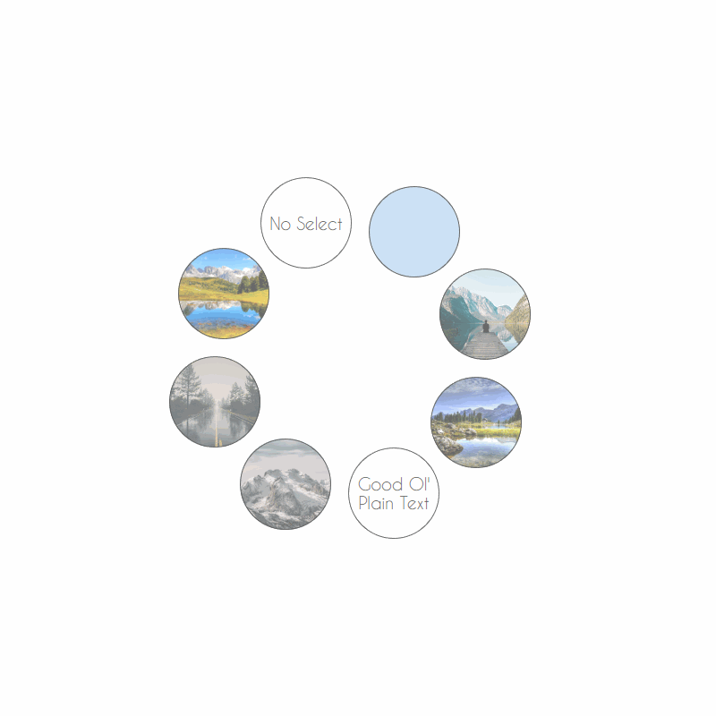

# Bubble List

<strong>Background</strong><br/>
I created this web plugin because I wanted a cool way to display projects that I've worked on. I tinkered with different ideas and decided I wanted to have a list of circles(bubbles) that could display different project information. I also knew that I work on new projects relatively often and would be adding to the list frequently so it needed to be easily scalable.<br/>
After some Googling I wasn't able to find anything out there capable of implementing what I wanted so I decided to make it myself.<br/><br/>

<strong>Information</strong><br/>
This plugin can be used to make a circular list of bubbles. There are different settings for each bubble such as enlarging on click, containing text, containing images, etc...<br/>
It is  scalable so once you have the list positioned and set to your liking you can add new bubbles to the list by just adding a new bubble div to the layout hierachy. The positioning of the bubbles uses polar coordinates and evenly distrubutes each bubble around a central axis in a radius you specify.<br/>
You can use this plugin having only HTML and some CSS knowledge!<br/>
<i>I hope you good folks get some use out of it!</i>



<br/>
<strong>HOW TO USE:</strong>
At the top of the bubblelist.scss file their is a list of variables that can be customised to your liking. These include circle diameters, border styles, fonts, etc...
<br/><br/>


<strong style="test-decoration:underline">EXAMPLE LAYOUT:</strong>
```HTML
<div class="bubbleList">
    <div class="bubbleContainer">
        <div class="bubble">
            
            <div class="bubbleBackgroundColor">#FFFFFF</div>
            <div class="bubbleBackgroundText">Background Text</div>
            <div class="bubbleBanner">BANNER</div>
            <div class="bubbleHeader">HEADER</div>
            <div class="bubbleDescription">Some Description</div>
            <div class="bubbleFooter"></div>
        </div>
    </div>
    <div class="bubbleContainer">
        <div class="nonHoverableBubble bubble">
            <div class="bubbleBackgroundColor">#FFFFFF</div>
            <div class="bubbleBackgroundText">Background Text</div>
        </div>
    </div>
    <div class="bubbleContainer">
        <div class="nonSelectableBubble bubble">
            <div class="bubbleBackgroundText">Background Text</div>
        </div>
    </div>
    <div class="bubbleContainer">
        <div class="nonHoverableBubble nonSelectableBubble bubble">
            <div class="bubbleBackgroundText">Background Text</div>
        </div>
    </div>
</div>
```

<br/>
<strong style="test-decoration:underline">CLASS DEFINITION:</strong>
<br/>


<strong>REQUIRED:</strong>
You MUST include each of the following classes to create the bubble list.<br/>

<i>bubbleList</i>: The top parent node of the list.<br/>
<i>bubbleContainer</i>: The container for each bubble item.<br/>
<i>bubble</i>: The bubble node itself.

<br/>

<strong>OPTIONAL:</strong>
Each of the following are optional. You can use each in any combination you like, but only use a tag once inside each bubble.<br/>

<i>bubbleBackgroundImage</i>: Use the src attribute in the img tag to set the source of the background image you want to use for the bubble.<br/>
<i>bubbleBackgroundColor</i>: Set the text inside this div to the hexidecimal color code you would like the bubbles background to be set as. This color affects both the base bubble, hovered, and active. If you set a background image that will cover the color, but the active bubble will still have this background color.<br/>
<i>bubbleBackgroundText</i>: Puts text in the front of the base and hovered bubble. If you add a banner to the bubble it will cover this text when the bubble is hovered. This text will appear in front of both the background image and/or background color you set.<br/>
<i>bubbleBanner</i>: The text used for the banner when the bubble is hovered.<br/>
<i>bubbleHeader</i>: The text used for the header when the bubble is clicked and is active.<br/>
<i>bubbleFooter</i>: The text used for the footer when the bubble is clicked and is active.<br/>
<i>bubbleDescription</i>: The text used for the description when the bubble is clicked and is active. If you use a link(e.g. 'a' node) then clicking on the link will not close the active bubble.<br/>
<i>nonSelectableBubble</i>: Put this class in the bubble class list if you want to disable the ability to click it and make an active bubble appear.<br/>
<i>nonHoverableBubble</i>: Put this class in the bubble class list if you want to disable the ability to hover it.<br/>

<strong>Note</strong>: The <i>nonSelectableBubble</i> and <i>nonHoverableBubble</i> classes can be used together to make a bubble that can be neither hovered nor clicked.
